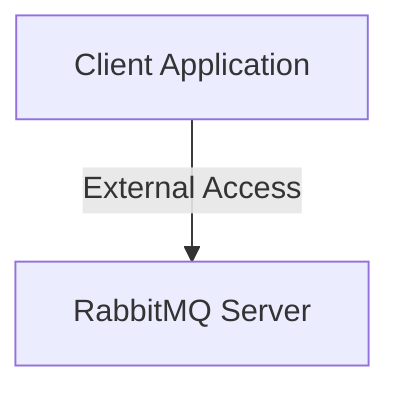

# RabbitMQ Setup with Alpine Image and Management Dashboard

This project sets up a single RabbitMQ instance using an Alpine-based Docker image. It includes the RabbitMQ Management Dashboard for monitoring and administrating the server. This README provides a comprehensive guide on the architecture, setup, and testing for effective RabbitMQ usage in a Python environment.

## Table of Contents

- [Architecture Overview](#architecture-overview)
  - [Architecture Diagram](#architecture-diagram)
  - [Components Explained](#components-explained)
- [RabbitMQ Usage](#rabbitmq-usage)
  - [Connecting to RabbitMQ](#connecting-to-rabbitmq)
  - [Producing and Consuming Messages](#producing-and-consuming-messages)
    - [Producer Methods](#producer-methods)
    - [Consumer Methods](#consumer-methods)
- [Testing Code Setup](#testing-code-setup)
  - [Directory Structure](#directory-structure)
  - [Producer and Consumer Scripts](#producer-and-consumer-scripts)
- [Running the Testing Code](#running-the-testing-code)
  - [Step-by-Step Instructions](#step-by-step-instructions)
- [Accessing the Management Dashboard](#accessing-the-management-dashboard)
  - [Features of the Management Dashboard](#features-of-the-management-dashboard)
- [Docker Compose Configuration](#docker-compose-configuration)
  - [Explanation of `docker-compose.yml`](#explanation-of-docker-composeyml)
  - [Common Issues and Solutions](#common-issues-and-solutions)
  - [Quick Reference: Complete `docker-compose.yml`](#quick-reference-complete-docker-composeyml)
- [Additional Enhancements and Best Practices](#additional-enhancements-and-best-practices)
- [Conclusion](#conclusion)

---

## Architecture Overview

The architecture comprises:

- **1 RabbitMQ Node** (`rabbitmq`): A standalone RabbitMQ server configured for external client access and management using an Alpine-based image.

### Architecture Diagram



### Components Explained

- **RabbitMQ Server**: A single RabbitMQ instance using the Alpine-based image for a lightweight and efficient setup. It handles message queuing, providing reliable messaging for your applications. The management plugin is enabled for monitoring and administrating the server through a web-based UI.

## RabbitMQ Usage

### Connecting to RabbitMQ

To connect to this RabbitMQ server, use the server address and port in your client configuration.

- **Example of Server Address**: `localhost:5672`

### Producing and Consuming Messages

#### Producer Methods

- **Description**: Producers create messages and send them to a specific RabbitMQ queue.
- **Usage**:
  - Initialize a connection using `pika.BlockingConnection`.
  - Declare the queue with `channel.queue_declare()`.
  - Publish messages with `channel.basic_publish()`.

- **Example of Use**:

  ```python
  import pika
  import json
  import time

  # Establish connection to RabbitMQ server
  connection = pika.BlockingConnection(pika.ConnectionParameters('localhost', 5672))
  channel = connection.channel()

  # Declare a queue named 'test_queue'
  channel.queue_declare(queue='test_queue')

  # Create a message
  message = json.dumps({"field": "value", "timestamp": time.time()})

  # Publish the message to the queue
  channel.basic_publish(exchange='', routing_key='test_queue', body=message)
  print(" [x] Sent message")

  # Close the connection
  connection.close()
  ```

#### Consumer Methods

- **Description**: Consumers listen to RabbitMQ queues to retrieve messages.
- **Usage**:
  - Initialize a connection using `pika.BlockingConnection`.
  - Declare the queue with `channel.queue_declare()`.
  - Define a callback function to process incoming messages.
  - Start consuming with `channel.basic_consume()` and `channel.start_consuming()`.

- **Example of Use**:

  ```python
  import pika
  import json

  # Define a callback function to process messages
  def callback(ch, method, properties, body):
      message = json.loads(body)
      print(" [x] Received message:", message)

  # Establish connection to RabbitMQ server
  connection = pika.BlockingConnection(pika.ConnectionParameters('localhost', 5672))
  channel = connection.channel()

  # Declare the queue to consume from
  channel.queue_declare(queue='test_queue')

  # Set up subscription with the callback
  channel.basic_consume(queue='test_queue', on_message_callback=callback, auto_ack=True)

  print('Waiting for messages. To exit press CTRL+C')

  # Start consuming
  channel.start_consuming()
  ```

## Testing Code Setup

### Directory Structure

Create a `test` folder in your project directory with the following structure:

```text
test/
├── producer.py
└── consumer.py
```

### Producer and Consumer Scripts

- **`producer.py`**: Produces JSON-encoded messages to a RabbitMQ queue named `test_queue`.
- **`consumer.py`**: Consumes JSON-decoded messages from the `test_queue` to confirm connectivity and data flow.

## Running the Testing Code

### Step-by-Step Instructions

1. **Set Up Virtual Environment (`venv`)**:
   - Create and activate a virtual environment to isolate dependencies.
   - Navigate to your project directory:

     ```bash
     python3 -m venv venv
     source venv/bin/activate  # On Windows use: venv\Scripts\activate
     ```

2. **Install Dependencies**:
   - Inside the virtual environment, install the required libraries:

     ```bash
     pip install pika
     ```

3. **Run Docker Containers**:
   - Start your RabbitMQ server using Docker Compose:

     ```bash
     docker-compose up -d
     ```

   - **Verify Containers**:
     - Ensure that the RabbitMQ container is running:

       ```bash
       docker ps
       ```

4. **Run the Consumer**:
   - Open a new terminal, activate the virtual environment, and navigate to the `test` folder:

     ```bash
     source venv/bin/activate  # On Windows use: venv\Scripts\activate
     python test/consumer.py
     ```

   - The consumer should display:

     ```text
     Waiting for messages. To exit press CTRL+C
     ```

5. **Run the Producer**:
   - In another terminal, activate the virtual environment, and run the producer:

     ```bash
     source venv/bin/activate  # On Windows use: venv\Scripts\activate
     python test/producer.py
     ```

   - The producer should display:

     ```console
      [x] Sent message
     ```

6. **Verify Output**:
   - The **consumer** terminal should display the messages produced by the producer, confirming the connection and data flow. Example:

     ```console
      [x] Received message: {'field': 'value', 'timestamp': 1701308250.123456}
     ```

7. **Clean Up**:
   - After testing, stop the Docker services and deactivate the virtual environment:

     ```bash
     docker-compose down
     deactivate
     ```

## Accessing the Management Dashboard

- **URL**: [http://localhost:15672](http://localhost:15672)
- **Default Credentials**:
  - **Username**: `guest`
  - **Password**: `guest`

### Features of the Management Dashboard

- **Overview**: Provides a summary of the RabbitMQ server, including total connections, channels, queues, and exchanges.
- **Connections**: View and manage active connections to the RabbitMQ server.
- **Channels**: Monitor and manage channels within each connection.
- **Queues**: Inspect queues, view message rates, and manage queue properties.
- **Exchanges**: View and manage exchanges and their bindings.
- **Admin**: Manage users, permissions, and policies.

## Docker Compose Configuration

Below is the updated `docker-compose.yml` file to set up a single RabbitMQ server using an Alpine-based image with the management dashboard enabled.

### Complete `docker-compose.yml`

```yaml
version: '3.8'

services:
  rabbitmq:
    image: rabbitmq:3.11-management-alpine
    container_name: rabbitmq
    hostname: rabbitmq
    ports:
      - "5672:5672"       # AMQP protocol
      - "15672:15672"     # Management UI
    environment:
      RABBITMQ_DEFAULT_USER: 'guest'
      RABBITMQ_DEFAULT_PASS: 'guest'
    networks:
      - rabbitmq_net
    volumes:
      - rabbitmq_data:/var/lib/rabbitmq

networks:
  rabbitmq_net:
    driver: bridge

volumes:
  rabbitmq_data:
    driver: local
```

### Explanation of `docker-compose.yml`

- **version**: Specifies the version of Docker Compose syntax. Version `3.8` is used here for compatibility.

- **services**:
  - **rabbitmq**:
    - **image**: Uses the `rabbitmq:3.11-management-alpine` image, which is an Alpine-based image with the RabbitMQ server and management plugin enabled for a lightweight setup.
    - **container_name**: Names the container `rabbitmq` for easy reference.
    - **hostname**: Sets the container's hostname to `rabbitmq`.
    - **ports**:
      - `"5672:5672"`: Maps the AMQP protocol port for RabbitMQ clients.
      - `"15672:15672"`: Maps the port for accessing the RabbitMQ Management Dashboard.
    - **environment**:
      - `RABBITMQ_DEFAULT_USER`: Sets the default username (`guest`).
      - `RABBITMQ_DEFAULT_PASS`: Sets the default password (`guest`).
    - **networks**:
      - Connects the RabbitMQ service to the `rabbitmq_net` network.
    - **volumes**:
      - `rabbitmq_data`: Mounts a Docker volume to persist RabbitMQ data, ensuring data persistence across container restarts.

- **networks**:
  - **rabbitmq_net**:
    - **driver**: Specifies the network driver as `bridge`, which is suitable for standalone containers.

- **volumes**:
  - **rabbitmq_data**:
    - **driver**: Uses the default `local` driver to store data on the host filesystem.

### Common Issues and Solutions

1. **Network Not Defined Error**:
   - **Issue**: If you encounter an error stating that `rabbitmq_net` is not set or defined, ensure that the `networks` section is correctly indented and defined at the root level of the `docker-compose.yml` file.
   - **Solution**: Verify that the `networks` section is properly placed and that the service references the network correctly.

2. **Port Conflicts**:
   - **Issue**: Ports `5672` or `15672` might already be in use on your host machine.
   - **Solution**: Ensure these ports are free or modify the port mappings in the `docker-compose.yml` to use different host ports. For example:

     ```yaml
     ports:
       - "5673:5672"
       - "15673:15672"
     ```

3. **Data Persistence**:
   - **Issue**: Without the `volumes` configuration, RabbitMQ data won't persist after container restarts.
   - **Solution**: The updated `docker-compose.yml` includes a `volumes` section to persist data.

### Quick Reference: Complete `docker-compose.yml`

For your convenience, here's the complete and corrected `docker-compose.yml` file:

```yaml
version: '3.8'

services:
  rabbitmq:
    image: rabbitmq:3.11-management-alpine
    container_name: rabbitmq
    hostname: rabbitmq
    ports:
      - "5672:5672"       # AMQP protocol
      - "15672:15672"     # Management UI
    environment:
      RABBITMQ_DEFAULT_USER: 'guest'
      RABBITMQ_DEFAULT_PASS: 'guest'
    networks:
      - rabbitmq_net
    volumes:
      - rabbitmq_data:/var/lib/rabbitmq

networks:
  rabbitmq_net:
    driver: bridge

volumes:
  rabbitmq_data:
    driver: local
```

#### Steps to Use `docker-compose.yml`

1. **Save the File**:
   - Save the above YAML content into a file named `docker-compose.yml` in your project directory.

2. **Start the Container**:
   - Navigate to your project directory in the terminal and run:

     ```bash
     docker-compose up -d
     ```

3. **Verify the Setup**:
   - Check the running containers:

     ```bash
     docker ps
     ```

   - Access the Management Dashboard at [http://localhost:15672](http://localhost:15672).

4. **Stop the Container**:
   - When you're done, you can stop and remove the containers with:

     ```bash
     docker-compose down
     ```

## Additional Enhancements and Best Practices

1. **Data Persistence**:
   - The updated `docker-compose.yml` includes a `volumes` section to persist RabbitMQ data. This ensures that your queues and messages are retained even if the container is restarted or recreated.

2. **Security Considerations**:
   - **Default Credentials**: The default `guest` user is limited to connections from `localhost`. For production environments, it's recommended to create dedicated users with appropriate permissions.
   - **Environment Variables**: Consider using Docker secrets or environment variable files (`.env`) to manage sensitive information securely.
   - **Firewall Rules**: Ensure that only trusted sources can access the RabbitMQ ports, especially in production environments.

3. **Monitoring and Alerts**:
   - Utilize the Management Dashboard to monitor RabbitMQ performance metrics.
   - Integrate with monitoring tools like Prometheus and Grafana for advanced monitoring and alerting.

4. **Scaling and High Availability**:
   - For production setups, consider deploying RabbitMQ in a clustered configuration with multiple nodes to ensure high availability and fault tolerance.
   - Utilize mirrored queues or quorum queues based on your durability and consistency requirements.

5. **Automated Backups**:
   - Implement automated backup strategies for RabbitMQ data to prevent data loss in case of failures.

6. **Logging**:
   - Configure RabbitMQ logging to capture detailed logs for troubleshooting and auditing purposes.

## Conclusion

This setup provides a lightweight and efficient RabbitMQ server configured with an Alpine-based Docker image and an accessible management dashboard. By following the setup and testing instructions, you can efficiently produce and consume messages, monitor your RabbitMQ instance, and ensure seamless communication within your Python applications.
