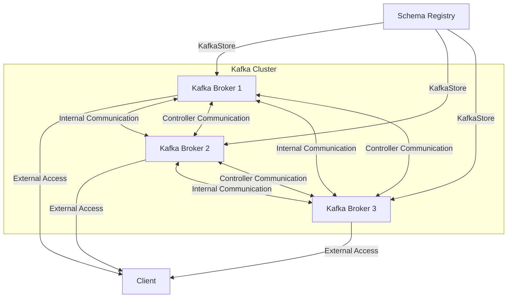

# Kafka Cluster with Schema Registry Integration

This project sets up a Kafka distributed cluster with three broker nodes and a Schema Registry. This README explains the architecture, setup, and testing for effective Kafka usage in a Python environment.

## Architecture Overview

The architecture comprises:

- **3 Kafka Brokers** (`kafka1`, `kafka2`, `kafka3`): Each broker is both a broker and a controller in Kraft mode, ensuring high availability and eliminating the need for Zookeeper.
- **Schema Registry** (`schema-registry`): Manages schemas for data serialization, allowing consistent data formatting and validation across different applications that produce and consume messages from Kafka topics.

### Architecture Diagram



### Components Explained

- **Kafka Brokers**: Each broker in this cluster is configured for internal communication, external client access, and controller quorum. This setup provides high availability, load balancing, and fault tolerance.
- **Schema Registry**: This component allows storing schemas (such as Avro) that define the structure of messages sent to Kafka topics. By using a centralized schema registry, producers and consumers ensure data compatibility and format consistency, simplifying serialization and deserialization tasks.

## Kafka Distributed Cluster Usage

### Connecting to Kafka

To connect to this distributed Kafka cluster, use the `bootstrap.servers` configuration by listing all broker addresses. This allows clients to handle broker failover and ensures they can access all partitions for topics across brokers.

- **Example of Server List**: `["localhost:9092", "localhost:9093", "localhost:9094"]`

### Producing and Consuming Messages

1. **Producer Methods**:
   - Producers create messages and send them to a specific Kafka topic.
   - **Usage**:
     - Initialize a stream using `create_stream()`.
     - Add a timestamp using `add_timestamp()`, followed by message values with `add_value()`.
   - **Example of Use**:
     - `create_stream()`: Creates a stream to organize data for the topic.
     - `add_timestamp()`: Adds a timestamp to each message. (E.g., `stream.parameters.buffer.add_timestamp(time.time())`)
     - `add_value()`: Inserts a field value into the message according to schema. (E.g., `stream.parameters.buffer.add_value("field", "value")`)

2. **Consumer Methods**:
   - Consumers listen to Kafka topics to retrieve messages.
   - **Usage**:
     - Define a function for handling incoming messages with `on_stream_received`.
     - Start the consumer with `subscribe()`.
   - **Example of Use**:
     - `on_stream_received`: Specifies a function to process data upon arrival.
     - `subscribe()`: Subscribes the consumer to start receiving messages.

3. **Schema Registry Usage**:
   - **Purpose**: Ensures that producers and consumers use compatible data schemas, allowing for data validation and consistency.
   - **Impact**: Schema Registry integration enables structured formats, such as Avro, providing a framework for serialization and deserialization.
   - **Method for Avro Integration**:
     - Register the schema for the topic in the Schema Registry.
     - Use Avro serializers to encode and decode messages, ensuring all clients adhere to a common data format.

### Testing Code Setup

1. **Directory Structure**:
   - Create a `test` folder in your project directory with the following structure:

        ```text
        test/
        ├── producer.py
        ├── consumer.py
        ```

2. **Producer and Consumer Scripts with Avro Serialization**:
   - The `producer.py` script produces Avro-encoded messages to a Kafka topic named `test`.
   - The `consumer.py` script consumes Avro-decoded messages from the `test` topic to confirm connectivity and data flow.

## Running the Testing Code

### Step-by-Step Instructions

1. **Set Up Virtual Environment (`venv`)**:
   - Create and activate a virtual environment to isolate dependencies.
   - Navigate to your project directory:

     ```bash
     python3 -m venv venv
     source venv/bin/activate  # On Windows use: venv\Scripts\activate
     ```

2. **Install Dependencies**:
   - Inside the virtual environment, install the Quix Streams library and Avro serialization library:

     ```bash
     pip install quixstreams fastavro
     ```

3. **Run Docker Containers**:
   - Start your Kafka and Schema Registry services using Docker Compose:

     ```bash
     docker-compose up -d
     ```

4. **Run the Consumer**:
   - Open a new terminal, activate the virtual environment, and navigate to the `test` folder:

     ```bash
     python test/consumer.py
     ```

5. **Run the Producer**:
   - In another terminal, activate the virtual environment, and run the producer:

     ```bash
     python test/producer.py
     ```

6. **Verify Output**:
   - The **consumer** terminal should display the messages produced by the producer, confirming the connection and schema compatibility.

7. **Clean Up**:
   - After testing, stop the Docker services and deactivate the virtual environment:

     ```bash
     docker-compose down
     deactivate
     ```
